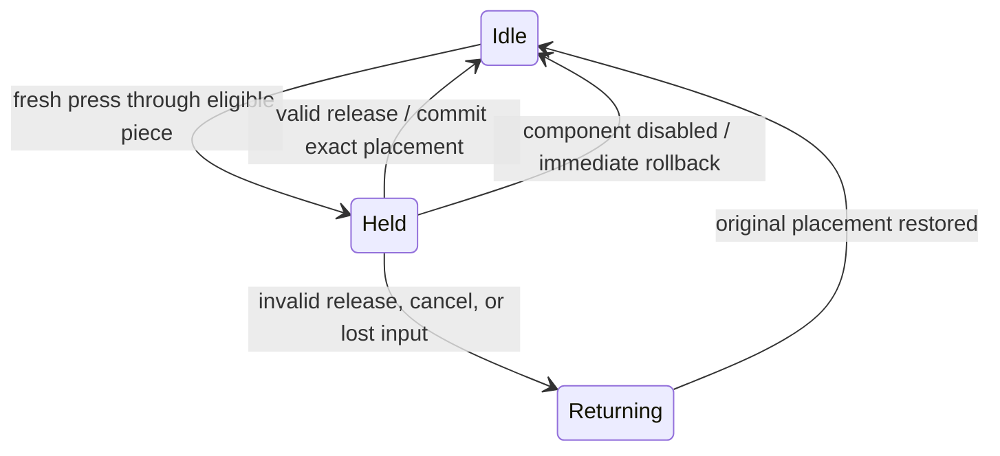

# Bounded object manipulation and paired Hanoi

The ordinary Unity package now contains `Bird3D.Manipulation` and an importable
**Hanoi Preview** sample. A normal tabletop puzzle and full-size building
sections share the same grip, work-volume, approach, placement and cancellation
components. This is a tested Unity prototype toward Bird World; it is not yet an
Udon implementation or an addition to the installed Quest application.

The geometric point, sphere fit, range, Kalman filter, click policy and accepted
cursor presentation are unchanged. The module consumes `BirdPointerInput` from
`Bird3D.UI`; no menu objects, hand SDK, core solver or editor code are required.

## Behavior

Point through a top piece and press/hold to acquire it. The nearest registered,
eligible collider intersection wins. Acquisition records the offset between the
logical point and the object's pivot, so a point well beyond a building does not
teleport that building to the cursor. Either hand can start a transaction; the
other hand cannot steal it. This first controller allows one transaction at a time.

Translation follows displacement from the acquisition point. The object's entire
configured box volume stays within an authored convex workspace. Bounds account
for the box's center, child transform, rotation and scale. The logical Bird point
remains untouched, including an endpoint a trillion meters away. Invalid volumes,
impossible workspaces and dynamic Rigidbody targets cannot be acquired.

Allowed destinations provide a final pivot position and a short approach segment.
Nearby motion is attracted toward that segment with a smooth distance weight.
A larger exit radius retains the current candidate while another lane becomes
slightly closer. Attraction falls to zero at the influence radius; retaining the
candidate outside it does not keep pulling the object. The sample shows a guide
and a footprint, then changes feedback when release can commit.

A firm placement requires all of the following:

- The experience rule still allows that destination.
- The **raw intended pivot**, before guidance or workspace clamping, is within
  its capture radius. A magnet or a boundary cannot fabricate drop intent.
- The visible moving pivot has caught up to within 1.5 capture radii.
- The exact destination fits the whole configured volume inside the workspace.

Release then commits the exact pivot position. Releasing elsewhere, explicit
cancel, tracking loss, a changed user or a frame pause over 250 ms starts a
quarter-second eased return to the last committed placement. Cancellation leaves
the puzzle model unchanged and keeps the item reserved until return completes.
Disabling the target/controller rolls back immediately because that component
cannot continue an animation. Explicit cancellation consumes a simultaneous
pickup edge. A recovered held press cannot reacquire automatically.



## Components and authoring

| Component | Responsibility |
| --- | --- |
| `BirdGrabInteractor` | Registered inputs/targets, nearest-hit selection, one transaction, translation and lifecycle |
| `BirdGrabTarget` | Explicit box volume, workspace, destinations, optional rule and serialized Grabbed/Placed/Cancelled UnityEvents |
| `BirdPlacementRegion` | Bounds in its local coordinate frame; feasible pivot bounds for the full box |
| `BirdSnapTarget` | Final pivot, local approach direction, approach length, influence/capture radii and hysteresis |
| `BirdPlacementRule` | Optional experience-specific reservation and legal/atomic placement policy |
| `BirdGrabFeedback` | Optional renderer tint with property-block restoration; no hit-geometry changes |
| `BirdHanoiBoard` (sample) | Top-piece and larger-on-smaller rules, stack heights, move counts and completion |

Attach these components through the Inspector or configure them before input
starts. Register both pointers and all selectable objects with one interactor;
do not give separate controllers the same input stream expecting shared arbitration.
The target's box must be on it or a descendant and enclose all relevant geometry.
The sample boxes also enclose the projecting windows. Targets are translation-only
kinematic objects; no Rigidbody is required. The destination transform represents
the object's **pivot**, not the bottom of its box. Approach/capture distances use
workspace-local units, so uniformly scaled experiences retain the same behavior.

Submit accepted logical samples before LateUpdate. The driver runs at order 120,
sample cues at 140 and optional feedback at 150. An explicit producer/test may
set `automatic=false` and call `Process(dt)`. The first-order follower integrates
a linearly changing target over each supplied interval and uses a small-interval
series to avoid cancellation at tiny positive timesteps. Zero/invalid time cancels
immediately. The existing input contract is latest-sample based; it does not queue
all press transitions between render updates. Producers must cancel on tracking
loss or when they stop publishing.

An experience rule must leave committed placement intact during `TryBegin`,
return eligibility without side effects from `CanGrab`/`CanPlace`, atomically
validate/update its model in `TryCommit`, and release its reservation in `Cancel`.
Hanoi repositions three shared candidate slots when a piece is reserved. It never
removes a piece from the committed stack while it is held. Reset is refused while
any piece is held or returning; the sample's reset command cancels first.

Scene reconfiguration belongs between transactions. Frame, parent, shape, scale
or rotation changes during a grip abort movement. This does not promise restoration
of externally edited geometry or the old world pose after the workspace itself
has moved. Do not concurrently animate/physically simulate the owned transform.
Optional feedback owns `_Color` while enabled and restores the captured property
block when disabled or rebound; another writer should not own that same property.

## Two scales and safety scope

| | Tabletop | Buildings |
| --- | ---: | ---: |
| Scale per workspace unit | 0.2 m | 75 m |
| Piece heights | 6.8, 8.4, 10 cm | 25.5, 31.5, 37.5 m |
| Largest piece width | 22.4 cm | 84 m |
| Initial full stack height | 25.2 cm | 94.5 m |

The building workspace is centered 420 m along the scene's forward axis. Its
front boundary is 322.5 m away, and no part of the configured held box can cross
that boundary. Tests verify its minimum world Z remains over 300 m when Bird
returns to the viewer. This is an authored safe work area for the fixed viewing
terrace, not a dynamic collision-avoidance system. An eventual world must keep
players' walk/teleport areas outside the building workspace or add an explicit
occupied-space policy.

This slice does not prevent pieces passing through other pieces during free
dragging, automatically lift over obstacles, rotate/scale held objects, allow
arbitrary free-space final drops, or synchronize multiple clients. Those policies
belong above geometric Bird and should be deliberate follow-on work. A host that
also runs a foreground menu must arbitrate that input or disable world gripping
while the menu owns it; these independent consumers do not share a global click
consumption mechanism. Map controls and richer general state animations remain open.

The preview uses simple shaded boxes and dark window blocks with
separated surfaces, shared instanced materials, visual guides and status text.
This is diagnostic scene design, not the intended final world art or layout.
Its optional desktop marker has its own demo sizing; it does not alter Plain
Inflate or the installed Quest cursor. Device cost and visual comfort are unmeasured.

## Reproduction and evidence, 2026-09-26

From the light repository:

```powershell
./tests/Invoke-UnityHanoiChecks.ps1 `
  -UnityEditor 'C:/Program Files/Unity/Hub/Editor/2022.3.22f1/Editor/Unity.exe' `
  -ProjectPath '../bird-3d-cursor-projects/Validation/Hanoi2022' -BuildPlayer
```

The runner accepts a new directory or one marked as its own generated project.
It imports the real local UPM package, copies the sample/helper files, resets each
result, enforces process deadlines and runs with actual graphics. `Assets/HanoiPreview.unity`
and `Build/BirdHanoiPreview.exe` remain usable interactively. Without the test
command-line flag, the player runs the desktop sample rather than the scripted test.

The current Unity 2022.3.22f1 D3D11 run passes **1216 assertions** and six camera
captures. Coverage includes both seven-move solutions; illegal drops; no-jump
offset/far-endpoint acquisition; soft versus firm placement; hysteresis; raw intent
versus clamp/magnet output; full-box containment under identity, upside-down,
rotated and nonuniform/mirrored scales; return convergence; input loss, user changes,
pause and disable; callback cancellation; fresh other-hand acquisition; material
restoration; and a real grip/drop invoking a persistent event after prefab reload.
Many assertions are individual corner checks along transformed trajectories.

The [30/72/120 Hz measurements](measurements/manipulation-translation-rates.csv)
record the same one-second translation in workspace units. They are synthetic
sample intervals, not measured device frame pacing or proof of perceptual equivalence.

The Windows x64 Mono build includes `Bird3D.Manipulation` and excludes the Bird
editor assembly. Its running player separately passes ordinary Update/LateUpdate
pickup, approach, exact drop, distant closed-hand bounding, tracking-loss return,
two rendered captures and generated-object cleanup. Human mouse input was not
used for this automated run. No additional Unity-version, Udon, VRChat-client,
Android/headset, multiplayer or subjective-feel claim follows.

Next: adapt this contract deliberately into the maintained local Udon world and
test through ClientSim, integrate menu/world input arbitration, then assess actual
hand-driven grip/snapping feel. Preserve the original adoption flow, mandala,
map/object controls and eventual shared/networked interaction policy.
